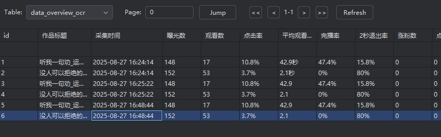
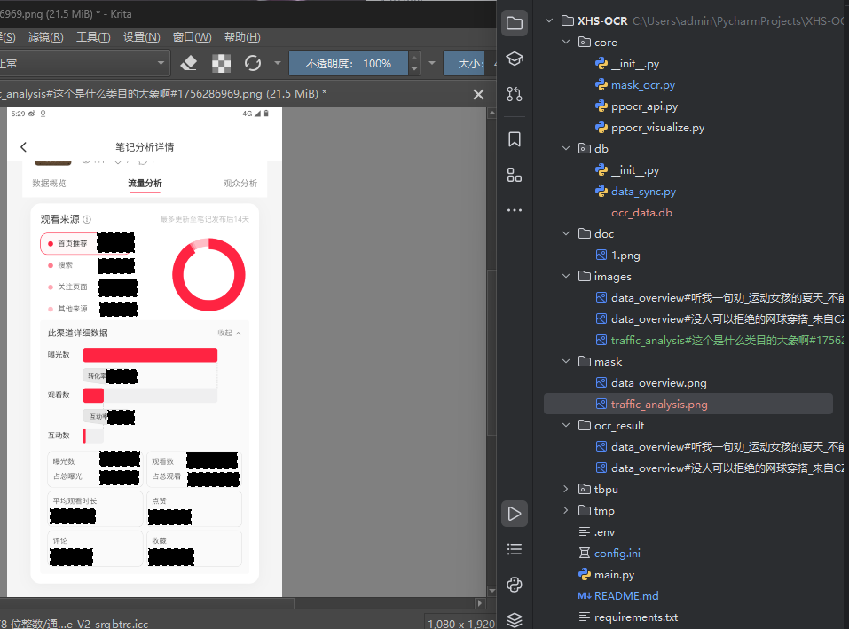

# XHS-OCR - 小红书数据OCR识别系统

一个用于识别小红书图片数据并保存到数据库的OCR系统。


只需要3步骤，实现OCR图片批量识别，并保存到本地数据库，并同步远程数据库

1. 创建一个又透明通道的mask图片（要同尺寸），放到mask目录下
2. 修改配置文件 `core/config.ini` 中的，按行从上到下的顺序写，每个涂抹区域对应的含义
3. 将需要ocr分析的图片放到images目录下，执行即可


## 安装依赖

```bash
pip install -r requirements.txt
```

## 使用方法

### 手动执行模式（默认）

```bash
# 执行OCR识别和数据同步
python main.py

# 或明确指定模式
python main.py --mode manual

# 执行OCR识别但不进行数据同步
python main.py --mode manual --no-sync
```

### 定时任务模式

```bash
# 每小时执行一次OCR识别和数据同步
python main.py --mode schedule

# 每30分钟执行一次OCR识别和数据同步
python main.py --mode schedule --interval 30

# 每天10:00执行一次OCR识别和数据同步
python main.py --mode schedule --at-time "18:00"

# 每小时执行OCR识别但不进行数据同步
python main.py --mode schedule --no-sync
```

在定时任务模式下，系统会按照指定的时间间隔或时间点自动执行OCR识别和数据同步任务。

## 项目结构

```
XHS-OCR/
├── core/                 # 核心功能模块
│   ├── mask_ocr.py       # OCR识别主程序
│   ├── config.ini        # 配置文件
│   └── ...               # 其他核心模块
├── db/                   # 数据库相关
│   ├── __init__.py       # 数据库操作模块
│   └── data_sync.py      # 数据同步模块
├── images/               # 待识别的图片
├── mask/                 # 遮罩图片
├── ocr_result/           # OCR识别结果
├── tmp/                  # 临时文件
├── main.py              # 主入口文件
└── requirements.txt     # 项目依赖
```

## 配置说明

### 1. OCR引擎配置

在 `core/mask_ocr.py` 中配置OCR引擎路径：

```python
ocr_engine_path = r"D:\PaddleOCR-json_v1.4.1\PaddleOCR-json.exe"
```

### 2. 数据库配置

通过环境变量配置远程MySQL数据库：

- `MYSQL_HOST`: MySQL服务器地址
- `MYSQL_PORT`: MySQL端口
- `MYSQL_USER`: 用户名
- `MYSQL_PASSWORD`: 密码
- `MYSQL_DATABASE`: 数据库名

### 3. 标签配置

在 `core/config.ini` 中配置标签和字段映射：

```ini
[tags]
data_overview = 曝光数,观看数,点击率,平均观看时长,完播率,2秒退出率,涨粉数,点赞数,评论数,收藏数
```

## 工作流程

1. 程序读取 `images/` 目录下的所有图片
2. 根据文件名中的标签信息，应用对应的遮罩图片
3. 使用OCR引擎识别处理后的图片
4. 将识别结果保存到本地SQLite数据库
5. 可选：将数据同步到远程MySQL数据库